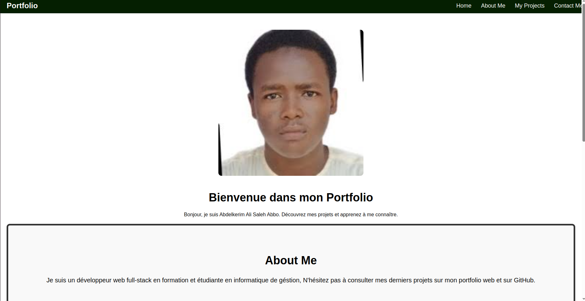

#  Portfolio Web – Abdelkerim Ali Saleh Abbo

Bienvenue dans le dépôt de mon **portfolio personnel**, développé en **HTML**, **CSS** et **JavaScript**. Ce site présente mes projets, mes compétences et propose un formulaire de contact.

---

##  Aperçu du projet

Voici un aperçu visuel de la page d’accueil de mon portfolio :



---

##  Technologies utilisées

- **HTML5** : pour la structure du site
- **CSS3** : pour la mise en forme et le style (dans `css/style.css`)
- **JavaScript** : pour les interactions dynamiques (dans `js/script.js`)

---


---

##  Fonctionnement technique

###  `index.html`

Fichier principal du site. Il contient :
- Une **barre de navigation** simple
- Une **section principale** avec une image (`img.jpeg`), un titre et une description.
- Une section **À propos de moi** : explique mon profil
- Une section **Projets** : affiche trois miniatures de projets avec des liens vers des pages HTML individuelles (`project1.html`, `project2.html`, `project3.html`. ).
- Un **formulaire de contact** fonctionnel avec nom, email et message.
- Intégration du fichier JS `script.js`.

###  `style.css`

Contient toutes les règles CSS :
- Disposition des sections
- Hover effects, transitions simples
- Couleurs, typographie, marges/paddings

###  `script.js`

Ce fichier peut être utilisé pour :
- Gérer l’interaction utilisateur (animations, défilement fluide, etc.)

---

##  Lancer le projet

1. Cloner le projet :
   ```bash
   git clone https://github.com/Abdelkerim516/Brief1.git
   ```
2. Ouvrir `index.html` dans un navigateur.

---

## 👤 Auteur

- **Nom** : Abdelkerim Ali Abbo

---

